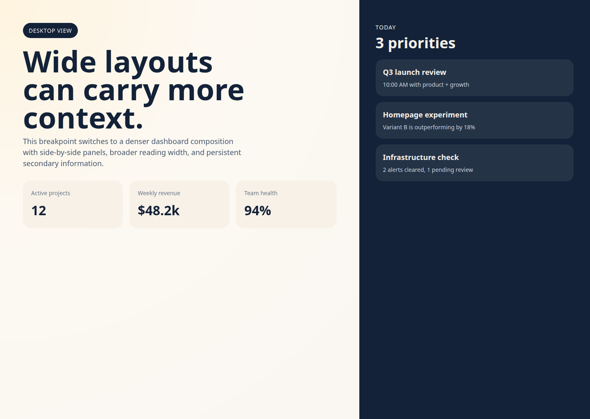
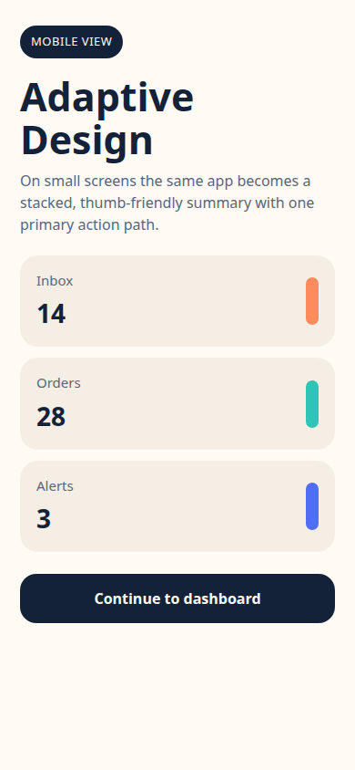

# useTailwindMediaQuery

React hooks for Tailwind-style breakpoints and arbitrary media queries.

## Motivation 

### Adaptive design

Use adaptive design when layouts should change structure across breakpoints, not just
resize. Good cases include dashboards, dense data views, and flows that need different
navigation or interaction patterns on mobile vs desktop.

Prefer plain responsive design when the same hierarchy still works and only spacing,
columns, or typography need to change.

## API

```tsx
import {
  useTailwindBreakpoint,
  useIsDesktop,
  useIsLargeDesktop,
  useIsMobile,
  useIsTablet,
  useMediaQuery,
} from 'useTailwindMediaQuery'
import type { TailwindBreakpoint } from 'useTailwindMediaQuery'
```

Built-in tailwind breakpoints (`TailwindBreakpoint`):

| Breakpoint | Min width |
| --- | --- |
| `sm` | `640px` |
| `md` | `768px` |
| `lg` | `1024px` |
| `xl` | `1280px` |
| `2xl` | `1536px` |

Hooks:

| Hook | Returns | Purpose |
| --- | --- | --- |
| `useMediaQuery(query: string)` | `bool` | Subscribe to any CSS media query |
| `useTailwindBreakpoint(tailwindBreakpoint: TailwindBreakpoint)` | `bool` | Tailwind breakpoint helper |
| `useIsMobile()` | `bool` | `true` below `md` |
| `useIsTablet()` | `bool` | `true` from `md` to below `lg` |
| `useIsDesktop()` | `bool` | `true` at `lg` and above |
| `useIsLargeDesktop()` | `bool` | `true` at `xl` and above |

## Examples

`useIsMobile` (`useIsTablet`, `useIsDesktop`, `useIsLargeDesktop`):

```tsx
import { useIsMobile } from 'useTailwindMediaQuery'

export function Example() {
  const isMobile = useIsMobile()

  return isMobile ? <MobileView /> : <DesktopView />
}
```

<table align="center">
  <tr>
    <td align="center">
      
      <div><strong>Desktop view</strong></div>
    </td>
    <td align="center">
      
      <div><strong>Mobile view</strong></div>
    </td>
  </tr>
</table>

`useTailwindBreakpoint`:

```tsx
import { useTailwindBreakpoint } from 'useTailwindMediaQuery'

export function SidebarLayout() {
  const showSidebar = useTailwindBreakpoint('lg')

  return showSidebar ? <DesktopLayout /> : <CompactLayout />
}
```

`useMediaQuery`:

```tsx
import { useMediaQuery } from 'useTailwindMediaQuery'

export function MotionPreference() {
  const prefersReducedMotion = useMediaQuery('(prefers-reduced-motion: reduce)')

  return <p>{prefersReducedMotion ? 'Reduced motion' : 'Full motion'}</p>
}
```


## SEO and SSR

If possible, keep both screen variants semantically equivalent. Adaptive design should
usually change layout and density, not core content. That is safer for SEO, accessibility,
and consistency.

With this library, server render does not know the real viewport:

| Hook | Server-render value |
| --- | --- |
| `useMediaQuery()` | `false` |
| `useTailwindBreakpoint()` | `false` |
| `useIsMobile()` | `true` |
| `useIsDesktop()` | `false` |

So this:

```tsx
return useIsMobile() ? <MobileView /> : <DesktopView />
```

renders the mobile branch on the server, then hydrates to the real client viewport.

If SEO matters, avoid putting unique primary content in only one branch. Keep headings,
copy, links, and other canonical content the same when possible, and reserve screen-
specific differences for layout or secondary UI.

## Development

```bash
pnpm install
pnpm run play # run vite playground
pnpm run test
pnpm run typecheck
pnpm run build
```
